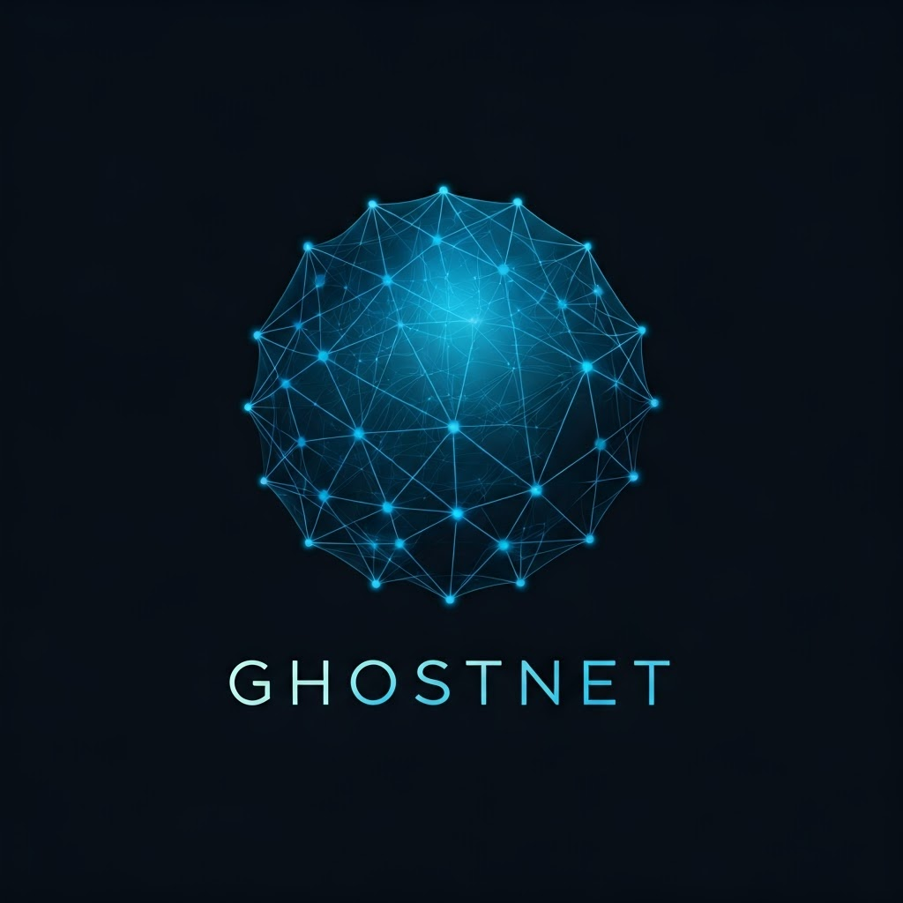

# GhostNet 👻 



<div align="center">
  
  [](LICENSE)
  [](https://www.python.org)
  [](https://github.com/servais1983/GhostNet/issues)
  [](https://github.com/servais1983/GhostNet/stargazers)
  
</div>

> ### 🛡️ **"Leurrer l'ennemi, Apprendre de ses tactiques, Protéger le Réel."**

## 📋 Résumé Exécutif

GhostNet est une plateforme de défense cybersécurité nouvelle génération qui utilise l'IA générative et la virtualisation avancée pour créer des réseaux leurres adaptatifs. Notre système détourne les attaquants vers des environnements fictifs, analyse leurs techniques et renforce automatiquement vos défenses réelles.

### ✅ Objectifs clés
- 🔄 Développer un réseau de leurre dynamique auto-adaptatif
- 🔍 Détecter et analyser les cyberattaques sophistiquées en temps réel
- 🛡️ Protéger les infrastructures critiques sans risquer les actifs réels

### 🚀 Applications principales
- 🏢 Protection des infrastructures critiques
- 🔎 Contre-espionnage industriel
- 📱 Sécurisation des objets connectés (IoT)

## ❓ Problématique

Les défenses traditionnelles sont de moins en moins efficaces face aux attaquants modernes :

- ⚠️ Les attaquants contournent facilement les honeypots statiques
- 🔒 Les entreprises manquent d'outils pour étudier les tactiques adverses sans risque
- ⚡ Les attaques zero-day et APT nécessitent une réponse immédiate et contextualisée

## 💡 Notre Solution

GhostNet crée un double virtuel de votre réseau, interconnecté au système réel mais isolé physiquement. Ce double :

- 🔄 **Mime le comportement** du réseau réel (services, données, logs) grâce à des GANs
- 🧠 **S'adapte en temps réel** aux techniques d'attaque via notre IA propriétaire
- 🎯 **Piège les attaquants** dans un environnement fictif pour:
  - 📊 Collecter des renseignements sur leurs méthodes
  - ⏱️ Gagner du temps pour renforcer vos défenses réelles

> 💬 *"La meilleure défense est une illusion que l'ennemi croit réelle."*

## 📚 Documentation

- [📐 Architecture Technique](docs/architecture.md)
- [🔧 Guide d'Installation](docs/installation.md)
- [📖 Guide d'Utilisation](docs/user_guide.md)
- [📋 Exemples de Configuration](docs/examples/README.md)
- [⚙️ API Reference](docs/api_reference.md)
- [🤝 Contribuer au Projet](CONTRIBUTING.md)

## 🔍 Cas d'Usage

### 🏙️ Protection d'une Smart City
Un attaquant tente de pirater les feux de signalisation connectés. GhostNet le redirige vers un réseau miroir fictif simulant la ville, pendant que l'IA étudie ses méthodes pour corriger les vulnérabilités réelles.

### 🧪 Contre-Espionnage Industriel
Une entreprise pharmaceutique est ciblée pour vol de brevets. GhostNet déploie des leurres de serveurs R&D contenant de faux schémas moléculaires piégés et suit l'exfiltration de données pour identifier les acteurs malveillants.

### 🏠 Sécurisation des IoT Grand Public
Face à un piratage massif de caméras connectées, GhostNet crée des milliers de caméras fantômes qui infectent les bots adverses avec des contre-malwares.

## ⚡ Démarrage Rapide

```bash
# Cloner le dépôt
git clone https://github.com/servais1983/GhostNet.git
cd GhostNet

# Installer les dépendances
pip install -r requirements.txt

# Lancer l'interface de configuration
python setup.py

# Démarrer le serveur GhostNet
python ghostnet/server.py --config=config/example.yaml
```

Pour plus de détails, consultez notre [🚀 Guide de Démarrage Rapide](docs/quickstart.md).

## 💻 Technologies

<div align="center">
  
  
  
  
  
  
  
</div>

## 📊 État du Projet

- ✅ MVP disponible
- 🔄 Développement actif
- 📅 Prochaine version: Q2 2025

## 📄 Licence

Ce projet est sous licence [MIT](LICENSE).

## 📧 Contact

Pour toute question ou suggestion, n'hésitez pas à [ouvrir une issue](https://github.com/servais1983/GhostNet/issues) ou à nous contacter directement.

---

<div align="center">
  
  GhostNet © 2025 - Protégez votre infrastructure avec intelligence
  
</div>
